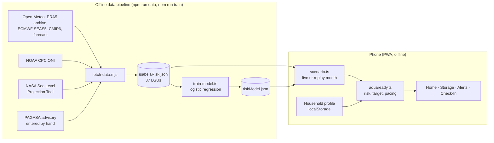

# AquaReady: Project Documentation

**AppCon Online Hackathon 2026 · Environmental Resilience Engine**

AquaReady is a household water plan for El Niño dry spells, piloted in Isabela Province. A family enters their town, who lives with them, and the containers they own. The app tells them **how much water to store, when to start, and how fast**, and warns them when their town's dry-spell risk goes up. Everything is in plain Filipino or English.

- **Repository:** https://github.com/Kazuhisaa/AquaReady
- **Install and run guide:** [README.md](../README.md)
- **Stack:** React 19 · TypeScript · Vite · Tailwind CSS v4 · offline-first PWA (no backend)

---

## 1. The problem

Isabela is a major rice- and corn-producing province in Cagayan Valley. During El Niño, rainfall there drops for months. In the 2023–24 El Niño, several Isabela towns reached PAGASA's dry-spell definition.

Families hear advisories like "El Niño is present", but an advisory doesn't tell a household:

- how many liters *their* family needs to have stored,
- whether *their* town is actually at risk,
- or when to start storing, and how much at a time, without spending too much at once.

As a result, families either store nothing until water runs short, or buy in a panic at the last minute.

## 2. The solution

AquaReady turns open climate data into one household-level action: **"Store 300–420 L. Add 20 L every 3 days."**

| Question the family has | What AquaReady answers | How |
|---|---|---|
| Is my town at risk? | Low / medium / high dry-spell risk for the next 3 months, per municipality (37 LGUs) | Trained AI model + ECMWF 51-member seasonal forecast |
| How much should we store? | A range in liters, never a false-precise single number | Sphere minimum (7.5 L/person/day), adjusted for the household, × reserve days set by the risk |
| When and how fast? | "Add X L every 3 days", finishing before the expected dry spell | Pacing spread over 3-day steps, rounded to 5 L |
| Why should I believe it? | Plain-language reasons, data sources, and the model's honest test scores | "Why?" and "How do we know?" sections |
| Did it work for us? | A check-in after the dry spell that adjusts the next target | Household calibration factor (×1.15 ran short / ×0.95 had extra) |

## 3. Features

### Household setup (4 steps, about a minute)
- Town and barangay.
- Family members by age group (adults, seniors, children, babies), with extra needs such as pregnancy, breastfeeding and medical needs.
- Water containers, from presets (drum, 5-gallon jug, timba, jerry can) or custom sizes.
- The profile is saved **only on the phone**. There is no account and no server.

### Home
- The town's risk level and the water target range. The full "stretch" tier (with bathing and cleaning) is shown separately.
- How many days the stored water lasts, and a readiness bar.
- One-tap logging: **+5 / +20 / +50 L**.

### Storage plan
- A routine ("Add 20 L every 3 days") and a target date.
- A drum gauge showing stored water, the target and container capacity.
- How to split each day's water: drinking and cooking, bathing, cleaning and flushing.
- **Water refill points:** lists known points for the town and lets families report a water point, or report that there is none (gap mapping for LGUs).

### Alerts
- **Rain chart:** 4 observed months plus 5 forecast months as a % of normal. It includes PAGASA's 80% line and outlines the months where a dry spell is reached.
- **Risk alert**, with:
  - "Do this now": a main action that changes with the situation.
  - "Why?": the causes, such as low rain, El Niño strength and dry soil.
  - A to-do list.
  - Climate outlook to 2050, and sea-level rise for the 4 coastal towns.
- **Pacing reminders** ("Time to add 20 L of water").
- **Heat alerts** when the heat index reaches PAGASA's *Danger* level (≥ 42 °C). They add drinking water to the target and give heat-stroke guidance.
- Optional phone notifications.

### Check-In
"Did your stored water last?" The answer (ran short / about right / had extra) adjusts the next target for that household.

### Time machine
Replays the **real 2023–24 El Niño** month by month (July 2023 → June 2024) using only data available at each point in time. Families and judges can see when the AI first warned compared with when the dry spell actually hit their town.

### Built for the people who use it
- **Filipino / English** toggle everywhere, with no jargon.
- **Works offline** after the first visit. It can be installed on the home screen like an app.
- Large, high-legibility type (Atkinson Hyperlegible) and a phone-first layout.
- A warning appears if the forecast data is more than 35 days old.

---

## 4. How it works

### Architecture



- **No backend and no database.** The climate data and the trained model ship inside the app, so it works with no signal, costs nothing to host, and no personal data leaves the phone.
- The data is refreshed about once a month with `npm run data` and `npm run train`, because ECMWF publishes a new seasonal forecast monthly.

### Risk score

```
risk = ½ × AI model probability + ½ × ECMWF ensemble probability
```

- **Dry spell** follows PAGASA's definition: 3 consecutive months at ≤ 80% of normal rain, or 2 months at ≤ 40%.
- **AI model:** a logistic regression with L2 regularization. It uses 7 features, all known at forecast time:
  - ONI (El Niño index) and its trend
  - last 3 months' rain, and last month's rain
  - root-zone soil moisture anomaly
  - season, as sin and cos terms
- **ECMWF probability:** the share of the 51 seasonal ensemble members whose rain reaches a dry spell.
- **Bands:** low < 30%, medium 30–60%, high ≥ 60%.

### Honest model evaluation

We split the data by time, so the model never saw the years it is tested on:

| Stage | Years |
|---|---|
| Fit | 1991–2004 |
| Choose model settings (validation) | 2005–2012 |
| Test, evaluated **once** | 2013–2020 and 2023–2026 |

| Test result | Value |
|---|---|
| AUC | **0.69** (moderate) |
| Brier skill vs. climatology | **+0.02** (slightly better than guessing from averages) |
| Dry spells caught at the 30% threshold | 65 of 153 |
| 2023–24 El Niño replay | warned **4 of 5** affected areas 1–2 months early; missed Dinapigue |

The model alone is only moderate, which is why it is blended 50/50 with the ECMWF physical forecast. The app shows these numbers to users under "How do we know?"

### Water target

- **Essential tier:** 7.5 L per person per day, the Sphere survival minimum for drinking, cooking and basic washing. It is adjusted for:
  - age, pregnancy and breastfeeding
  - formula-fed babies and medical needs
  - extreme heat
- **× reserve days**, from 3 days at low risk up to 14 days at high risk.
- Shown as a range from ×0.85 to ×1.20. The full tier (15 L per person per day) is a stretch goal.
- **Pacing:** the gap between stored water and the target is spread across 3-day steps, finishing before the expected dry-spell month.
- **Heat index:** NOAA's Rothfusz formula on hourly temperature and humidity, grouped into PAGASA's categories.

All formulas are in `src/services/aquaready.ts` and checked by `npm run check:aquaready`.

---

## 5. Data sources (all open, no API keys)

| Data | Source |
|---|---|
| 6-month rain forecast (51-member ensemble) | ECMWF SEAS5 via Open-Meteo |
| Normal rain 1991–2020, observed rain, soil moisture | ERA5 via Open-Meteo |
| Heat index (hourly temperature and humidity) | Open-Meteo forecast |
| Rain and temperature change to 2041–2050 | CMIP6 EC-Earth3P-HR via Open-Meteo |
| El Niño strength (ONI) | NOAA Climate Prediction Center |
| Sea level by 2050 (coastal towns) | IPCC AR6 via NASA Sea Level Projection Tool |
| El Niño advisory level | PAGASA |
| Towns and 2020 population | PSA 2020 Census |

---

## 6. What is new here

1. **From a province-level advisory to a household number.** It combines a trained model and a physical ensemble forecast for each town, then turns the result into liters and a routine for one specific family.
2. **Transparent AI.** It gives plain-language reasons, and the model's real test scores are shown inside the app, including where it failed.
3. **Time machine.** The forecast can be checked against a real past El Niño, using only the data that existed at each month.
4. **Learns from the household.** The check-in loop calibrates future targets to how that family actually uses water.
5. **Offline and private by design.** Everything works with no signal and no server, which suits rural areas with weak connectivity.

## 7. Maintainability and sustainability

- **Zero running cost:** a static site on any free host (Vercel or Netlify). There is no server or database to maintain.
- **Reproducible data:** one command refreshes all the climate data, and one retrains and re-tests the model. Downloads are cached and resume if interrupted.
- **Quality gates:** `npm run check:aquaready` (formula and alert tests), `npm run lint`, and `npm run build` (type-checks everything).
- **Scales to other provinces:** swap the town list and re-run the pipeline. The method uses only global open datasets.
- **Phase 2 path:** an opt-in backend for LGU and NGO dashboards, fed by the refill-point gap reports and check-in results. It would also add push notifications while the app is closed.

## 8. Known limits

- The risk is per municipality, because there is no open rainfall data at barangay level.
- The AI model is moderate (AUC 0.69). The ECMWF forecast reaches about 6 months ahead.
- The risk is based on rainfall. Real shortages also depend on water districts, dams and wells, which have no open data.
- Notifications appear only when the app is opened (there is no push server in this pilot).
- The profile lives on one phone and is lost if the browser data is cleared.

## 9. Try it

1. Follow the [README](../README.md) to run it: `npm install`, then `npm run dev`.
2. Tap **"Quick Demo: Load Santos Family (Cabagan)"**.
3. Visit **Home → Storage → Alerts**, and tap the risk alert.
4. Tap the 🕰️ clock icon to replay the 2023–24 El Niño.
5. Switch **EN / TL** to see the Filipino version.
